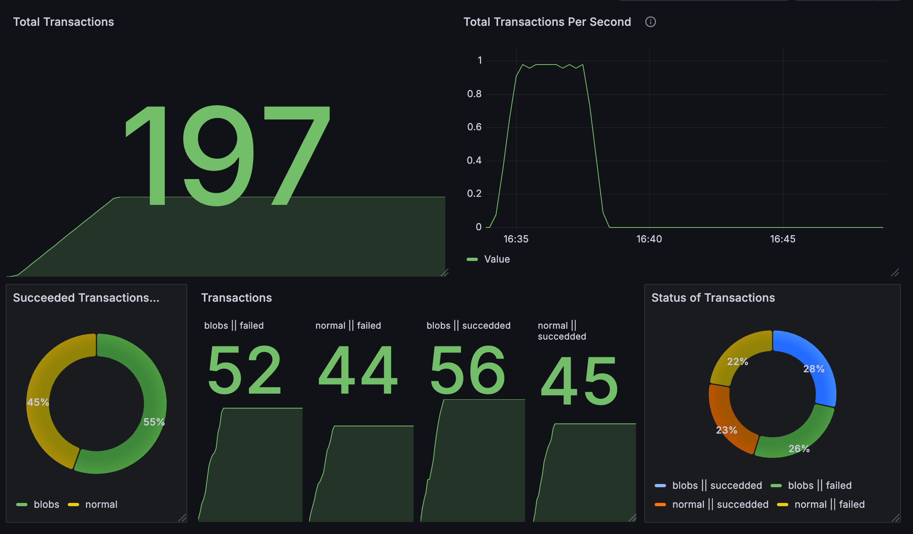

<h1 align="center">Prometheus & Grafana 🦀</h1>

<div align="center">

[What?](#what) - [Why?](#why) - [How?](#how)

[Resources](#resources)
</div>

# Why?

The idea behind this project is to learn about `Grafana` and `Prometheus`. It can be used as a template too.

# How?

- A `docker-compose` is used to bundle all the needed components:
  - PORT `3000` &rarr; API written in rust
  - PORT `3001` &rarr; Grafana
    - usr: `admin`
    - pwd: `admin` 
  - PORT `9090` &rarr; Prometheus

Using `make`, the containers are started, and the entire setup is initiated.

To test the dashboard, you can open Grafana in your preferred web browser with: http://localhost:3001/login. Login with the credentials (`admin`/`admin`), go to the `Dashboards` section and open the `Transactions DEMO` dashboard.

The panels will be blank. To populate them with data, we can send some information to the API:

```sh
watch -n 1 'curl -s -X POST http://localhost:3000/transact -H "Content-Type: application/json" -d '\''{"operation": "reada", "id": 4, "value": 100.50}'\'
```

We will be sending a POST request every second. The dashboard on the left should always show an increasing value, while the dashboard on the right should reach a value of 1, indicating 1 TPS.

The following image shows a possible output:



# What?

The key about this project is the `monitoring` folder. 

- `grafana_povisioning` &rarr; The `docker-compose.yaml` file mounts this folder
  - It has configuration files:
    - `dashboard.yaml`
    - `datasource.yaml`
    - Note: The `datasource.yaml` has a `uid` that is then used in `dashboard.json`. I've tried to export the dashboard as proposed by the following [URL](https://medium.com/@helia.barroso/how-to-managed-grafana-dashboard-in-multiple-environments-and-find-uid-harmony-eb262d830200), but it didn't work.
- `prometheus.yaml` &rarr; Scrapping interval and URL to scrap, prometheus scrapes the URL/metrics endpoint.


# Resources

- [Telegraf vs. Prometheus: Choosing the Right Metrics Collection Tool - NashTech Insights](https://blog.nashtechglobal.com/telegraf-vs-prometheus-choosing-the-right-metrics-collection-tool/)
- [How to Managed Grafana Dashboard in Multiple Environments — and find UID Harmony | by Hélia Barroso | Medium](https://medium.com/@helia.barroso/how-to-managed-grafana-dashboard-in-multiple-environments-and-find-uid-harmony-eb262d830200)
- [Visualizing Rust App Metrics using Prometheus & Grafana | Step by Step Guide - YouTube](https://www.youtube.com/watch?v=zFDIj7OufE8)
- [Quick start to instrumenting a Rust web app with Prometheus - YouTube](https://www.youtube.com/watch?v=x51zfjeVaR0)
